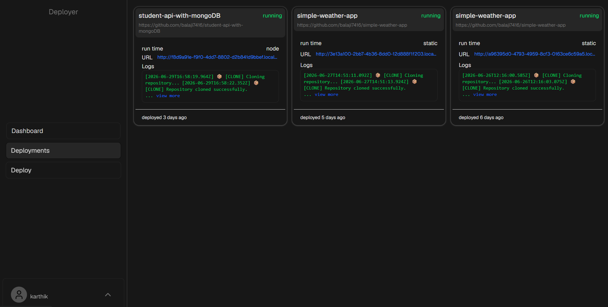
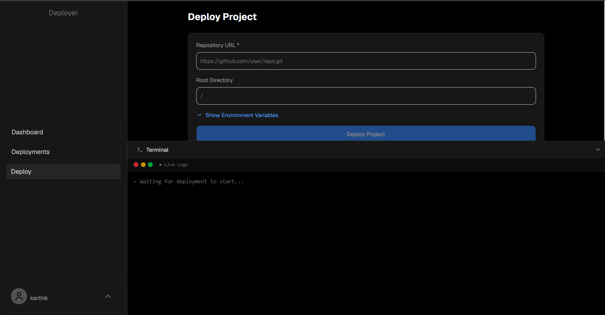
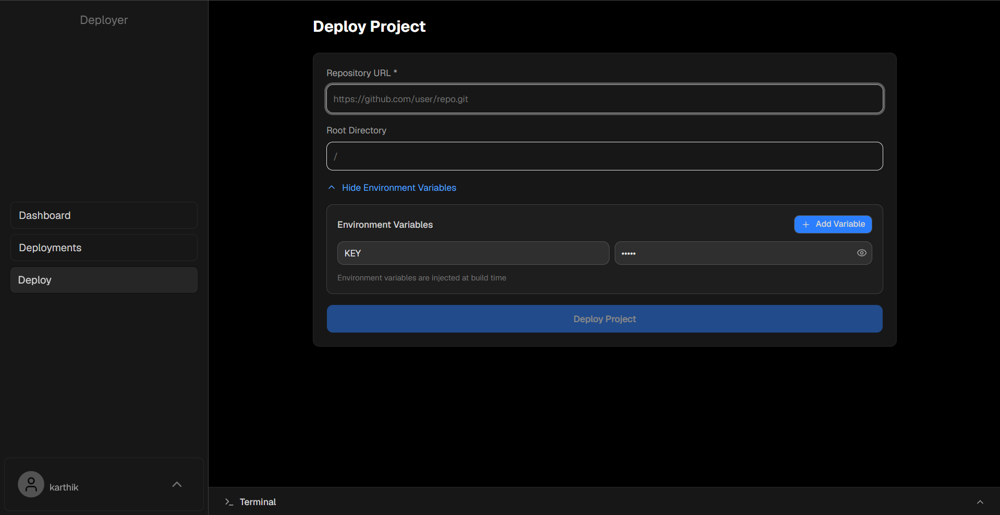
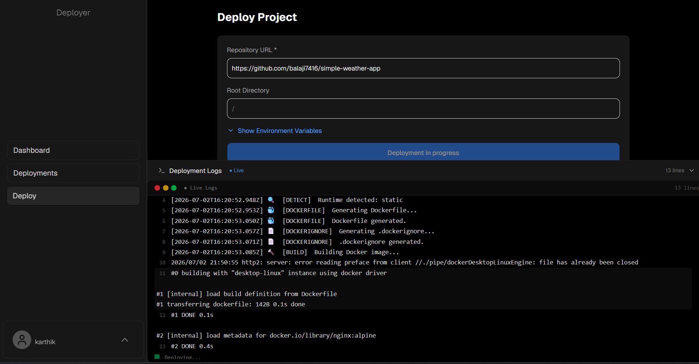
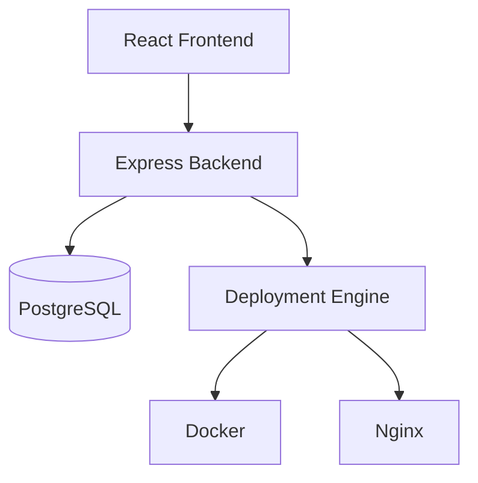
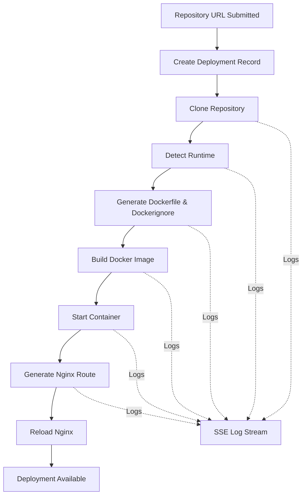

# Deployer

- platform that lets you deploy your projects with ease. provide a GitHub repository link and let the deployer do the rest.

## Screenshots

### Authentication


### Deployments Page



### Deploy Page





## Features

- deploy projects with GitHub repository link
- automatic project runtime detection
- automatic dockerfile generation based on runtime
- automatic build according to runtime
- dynmaic nginx configuration generation
- Real-time log streaming with SSE (server-sent events)
- URL based access through automatic reverse-proxy configuration
- support for multiple concurrent deployments
- supported runtimes:
  - Node.js
  - Python
  - Static (HTML, CSS, JavaScript)
  - Single Page Applications (React)
  - Custom user-provided Dockerfiles

## Architecture

- Deployer uses a simple deployment orchestration model
  - users create deployments with a GitHub repository link from the frontend
  - the deployment engine handles the actual deployment pipeline
  - the backend handles the deployment lifecycle, and storing metadata in the PostgreSQL database
  - Live logs are streamed to the frontend using server-sent events (SSE)



### Components

- **React Frontend** - the frontend user interface
- **Express Backend** - the backend server that handles API requests
- **PostgreSQL** - the database that stores deployment metadata
- **Deployment Engine** - the engine that handles the deployment pipeline
- **Docker** - the container runtime, for building and running containers in isolated environments
- **Nginx** - Reverse Proxy for routing traffic to the deployment containers without exposing ports

## Deployment Flow



## Tech Stack

### Frontend

- React
- TypeScript
- Tailwind CSS

### Backend

- Node.js
- Express
- TypeScript

### Database

- PostgreSQL

### Deployment

- Docker
- Nginx

## Getting Started

### Prerequisites

    - Node.js
    - Docker

### Installation

- **Clone the repository**

```bash
git clone https://github.com/balaji7416/deployer-
```

- **Set up Backend**
  - **_*Note:*_** run the following commands in the `backend` directory
  - use dummy `.env.example` as `.env` file / configure environment variables

    ```bash
       cp .env.example .env
    ```

  - **_install dependencies_**

    ```bash
    npm install
    ```

  - **_run migrations_**

    ```bash
    npm run migrate
    ```

  - **_run backend_**

    ```bash
    npm run dev
    ```

- **Set up Frontend**
  - **_*Note:*_** run the following commands in the `frontend` directory
  - **_install dependencies_**

    ```bash
    npm install
    ```

  - **_run frontend_**

    ```bash
    npm run dev
    ```

- **Start the Docker Daemon**
  - install docker desktop (if not already installed)
  - open docker desktop and start the docker daemon
  - if you are using linux run `sudo systemctl start docker`

## Access the Frontend and Backend

- You can access the frontend at http://localhost:5173
- You can access the backend at http://localhost:3001

## Future Improvements

- Automatic redeployment on Github push events
- Project workspace for organizing related deployments
- Additional runtime support

## Author

- Ramala Karthik
